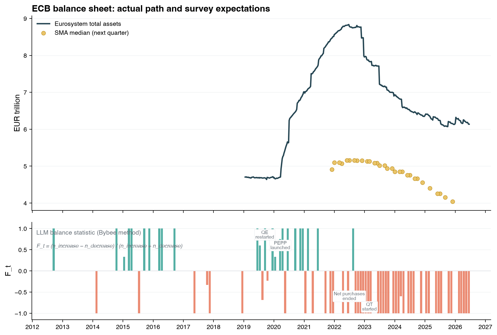
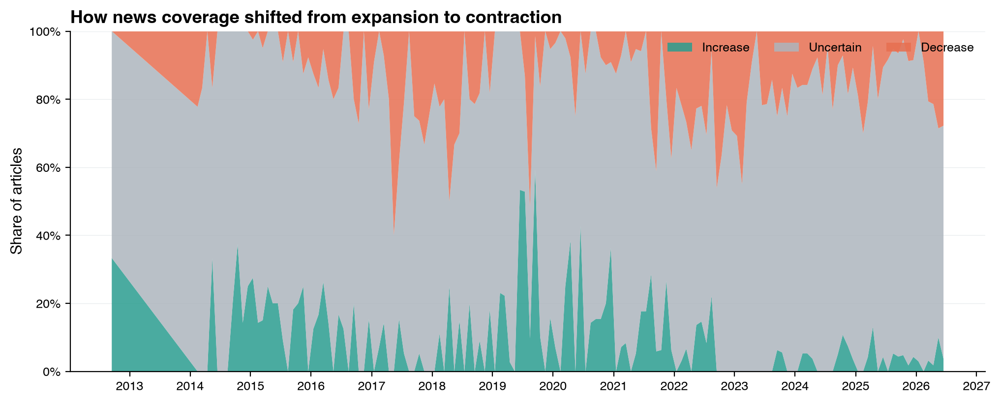
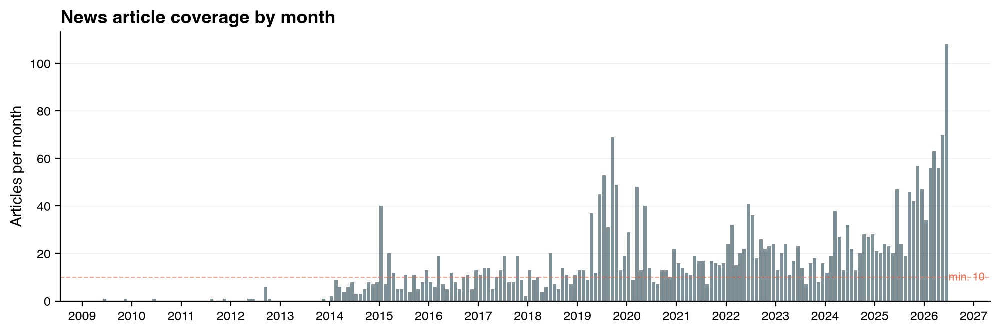
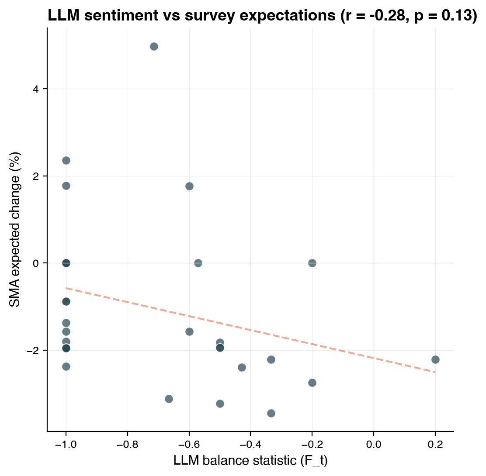
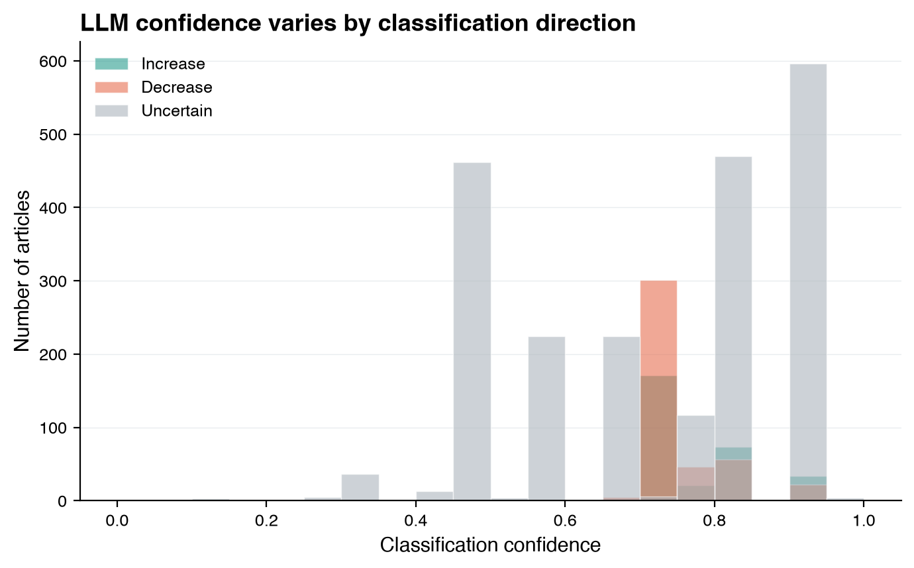
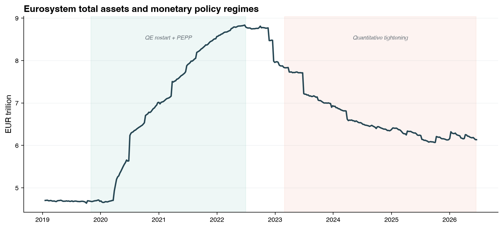

# ECB Balance Sheet Expectations: Survey vs LLM-Generated Beliefs

This project compares two sources of expectations about the ECB's balance sheet size (Eurosystem bond holdings under APP and PEPP):

1. **Survey-based**: ECB [Survey of Monetary Analysts](https://www.ecb.europa.eu/stats/ecb_surveys/sma/html/all-releases.en.html) (SMA), a quarterly survey of ~70 professional forecasters conducted since 2019
2. **LLM-generated**: Expectations extracted from news article headlines using the methodology of [Bybee (2025), "The Ghost in the Machine"](https://lelandbybee.com/files/LLM.pdf), where an LLM classifies each headline as implying the balance sheet will *increase*, *decrease*, or is *uncertain*

The LLM classifications are aggregated into a monthly **balance statistic**:

$$F_t = \frac{n_{\text{increase}} - n_{\text{decrease}}}{n_{\text{increase}} + n_{\text{decrease}}}$$

which ranges from -1 (all articles signal contraction) to +1 (all articles signal expansion).

## Key Findings

The LLM balance statistic correctly captures the major ECB policy regimes:
- **2019-2020**: Strong positive F_t when ECB restarted QE and launched PEPP
- **2022 onward**: Sharp transition to negative F_t when ECB ended net purchases and began quantitative tightening

Over 21 overlapping months with SMA data, the Pearson correlation between F_t and the SMA expected quarter-over-quarter change is r = -0.31 (p = 0.18). The negative sign reflects that during the overlap period (2022-2025) both measures agree on the direction (decrease), but more negative F_t values correspond to *faster* expected declines in the SMA.

## Figures

### Figure 1: Main comparison
Eurosystem total assets with SMA survey medians (top) and LLM balance statistic with key policy events annotated (bottom).



### Figure 2: Classification shares over time
Stacked area chart showing the share of articles classified as increase, uncertain, or decrease. The shift from green (expansion) to red (contraction) around 2022 is clearly visible.



### Figure 3: Article coverage
Monthly article counts. Coverage is densest in 2019-2020 (from GDELT) and sparser but consistent in 2021-2026 (from Google News RSS).



### Figure 4: LLM sentiment vs survey expectations
Scatter plot of F_t against the SMA expected percentage change in total holdings, with fitted trend line.



### Figure 5: Confidence distribution
Distribution of the LLM's self-reported confidence scores by classification direction.



### Figure 6: ECB balance sheet with policy regimes
Eurosystem total assets with shaded bands for the three main policy regimes: APP net purchases, QE restart + PEPP, and quantitative tightening.



## Data Sources

| Source | Coverage | Method |
|--------|----------|--------|
| ECB SMA CSV files | Dec 2021 - present | Direct download from ECB website |
| GDELT DOC 2.0 API | Apr 2019 - Apr 2020 | Keyword search for ECB balance sheet articles |
| Google News RSS | 2009 - 2026 | RSS feed search for ECB-related queries |
| ECB Data Portal | 2019 - present | Weekly Eurosystem total assets (series ILM/W.U2.C.T000000.Z5.Z01) |

## Pipeline

```
schema.py          Create DuckDB tables (idempotent)
collect_sma.py     Download ECB SMA survey data
collect_gdelt.py   Fetch articles from GDELT API
collect_gnews.py   Fetch articles from Google News RSS
collect_ecb_bs.py  Download actual ECB balance sheet data
process_headlines.py  Classify headlines with Claude (Bybee method)
aggregate.py       Compute monthly F_t balance statistic
compare.py         Pearson/Spearman correlation analysis
visualize.py       Generate figures (Healy-style)
run_pipeline.py    CLI orchestrator for all steps
```

Run the full pipeline:
```bash
export ANTHROPIC_API_KEY="your-key"
python3 run_pipeline.py
```

## Requirements

```
pip install duckdb pandas requests anthropic matplotlib scipy
```

## Database

All data is stored in a single DuckDB file (`ecb_bs.duckdb`) with tables:
- `sma_raw` / `sma_expectations` - Survey data
- `gdelt_articles` - News article headlines
- `llm_classifications` - LLM direction classifications
- `llm_expectations` - Monthly aggregated F_t
- `ecb_balance_sheet` - Actual ECB total assets

## Methodology

Following Bybee (2025), each news headline is sent to Claude Haiku 4.5 with the prompt:

> *Given the following news headline, assess whether it implies the ECB's balance sheet (Eurosystem stock of bonds under APP and PEPP) will INCREASE, DECREASE, or is UNCERTAIN in the near future.*

The model returns a structured JSON response with direction, confidence (0-1), magnitude, and a brief explanation. Classifications are aggregated monthly into the balance statistic F_t.

## References

- Bybee, L. (2025). [The Ghost in the Machine: Generating Beliefs with Large Language Models](https://lelandbybee.com/files/LLM.pdf). *Working Paper*.
- ECB Survey of Monetary Analysts: [All releases](https://www.ecb.europa.eu/stats/ecb_surveys/sma/html/all-releases.en.html)
- Healy, K. (2018). *Data Visualization: A Practical Introduction*. Princeton University Press.
