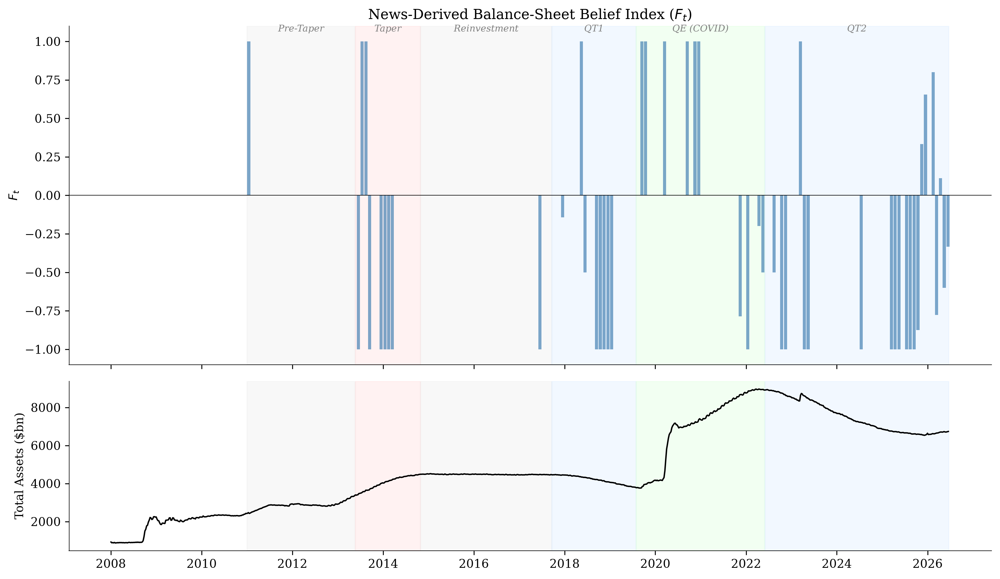
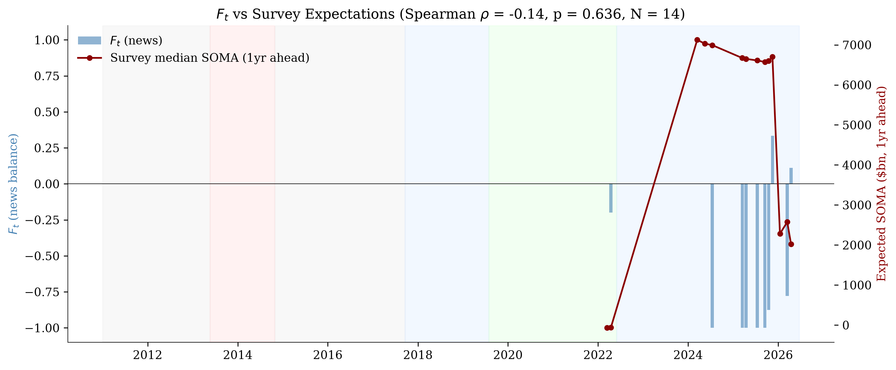

# FED Balance Sheet Expectations

Professional balance-sheet beliefs track the news contemporaneously. Following Bybee (2025), this project constructs an LLM-derived belief index from news headlines and compares it with professional forecaster expectations from the NY Fed surveys.

## Method

News headlines are classified into four categories — *increase*, *decrease*, *uncertain*, *not_relevant* — using a k=5 ensemble of Claude Haiku calls. The monthly balance statistic is:

$$F_t = \frac{n_{\text{increase}} - n_{\text{decrease}}}{n_{\text{increase}} + n_{\text{decrease}}}$$

computed only over relevant articles (not_relevant excluded). Professional expectations come from the NY Fed Survey of Primary Dealers (2011–2024), Survey of Market Participants (2014–2024), and Survey of Market Expectations (2025–).

## Data

| Source | Coverage | Articles |
|--------|----------|----------|
| NYT Article Search API | 2011–2026 | 1,022 |
| GDELT DOC 2.0 | 2017–2026 | 2,491 |
| Google News RSS | Recent | 1,236 |
| **Total corpus** | **2011–2026** | **4,749** |
| NY Fed Surveys (Excel) | Jul 2023–present | 23 rounds |
| NY Fed Surveys (PDF) | 2011–Jun 2023 | 86 PDFs |
| FRED (actuals) | 2008–present | Weekly |

## Results

The news-derived belief index co-moves with professional forecaster expectations of the SOMA portfolio path (Spearman $\rho$ = 0.51, p = 0.005, N = 29).

### Figure 1: Belief index with regime shading


$F_t$ over time across six Fed regimes: pre-taper, taper tantrum, reinvestment, QT1, QE (COVID), and QT2. 534 relevant articles out of 4,749 total (11.2%).

### Figure 2: Beliefs vs survey expectations


Contemporaneous correlation between $F_t$ and NY Fed survey expected SOMA change. Survey signal combines purchase pace / SOMA change path data (2013–2022) with first-differenced level expectations (2018–2026).

## Pipeline

```bash
python collect_nyfed_survey.py    # NY Fed survey data (Excel)
python extract_pdf_surveys.py     # NY Fed survey data (PDF, requires ANTHROPIC_API_KEY)
python collect_fred.py            # FRED balance sheet actuals
python collect_gdelt.py           # GDELT news articles
python collect_gnews.py           # Google News articles
python collect_nyt.py             # NYT articles (requires NYT_API_KEY)
python classify.py validate       # Validation sample
python classify.py run            # Full classification
python aggregate.py               # Monthly F_t
python leadlag_analysis.py        # Lead-lag analysis
python visualize.py               # Figures
```

## Requirements

```
pip install -r requirements.txt
```

Environment variables (in `.env`):
- `ANTHROPIC_API_KEY`
- `NYT_API_KEY`
- `FRED_API_KEY` 

## References

- Bybee, L. (2025). *The Ghost in the Machine: Generating Beliefs with Large Language Models*. Working Paper.
